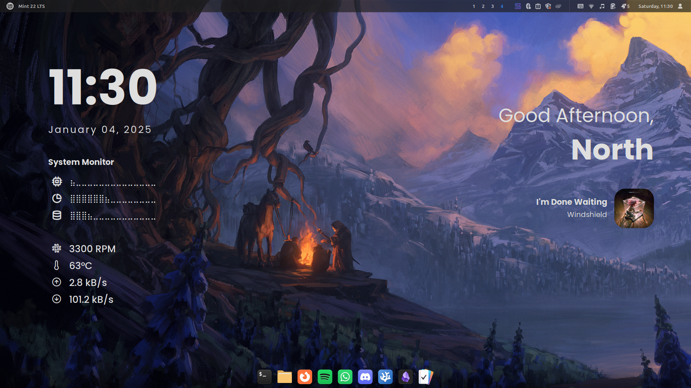

# EWW-Sleektop

Features:

- Clock and date display in 24 hour format.
- CPU, RAM, and root directory utilization monitor.
- Fan speed, CPU temperature, network Up/Down monitor.
- Spotify player display.
- Username greeting with respect to time of the day.

### Widgets Preview

On Cinnamon Desktop Environment, 1080p resolution. [Wallpaper](https://www.deviantart.com/ondrejhrdina/art/Dragon-Patrol-801178731)

### Installation

- Install Elkowar’s Wacky Widgets - [Instructions](https://elkowar.github.io/eww)
- Clone this repository
- Create eww config directory : **`~/.config/eww`**
- Copy everything from **`sleektop`** directory to **`~/.config/eww`**
- Install the required fonts from **`fonts`** directory
- Run **`launch-sleektop`** script in the **`sleektop`** directory
